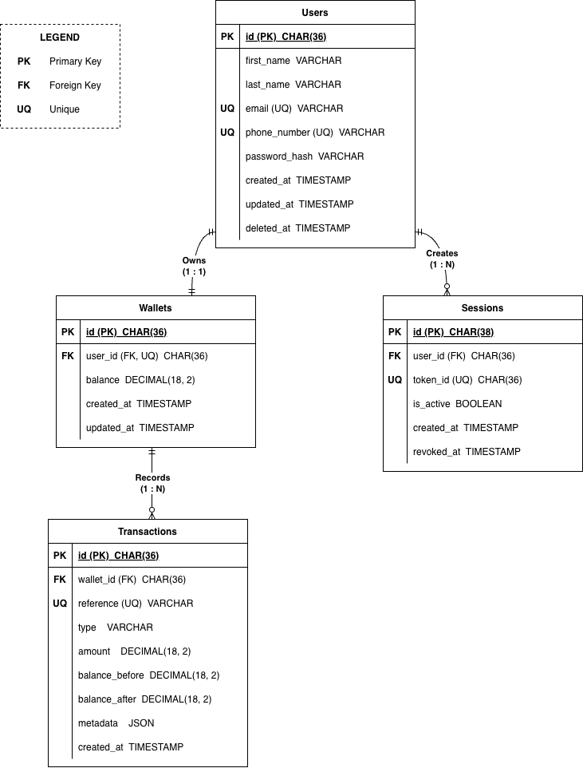

# Lendsqr Wallet Service

A backend wallet service built as part of the Lendsqr Backend Engineering Assessment.

The application provides user authentication, wallet management, blacklist verification using Adjutor, transaction recording, and fund transfers while maintaining transactional integrity and auditability.

---

# Features

## Authentication

* User signup
* User signin
* User signout
* JWT authentication
* Session management

## Wallet Operations

* Automatic wallet creation during signup
* Fund wallet
* Withdraw funds
* Transfer funds
* Transaction history

## Security

* Password hashing using bcrypt
* JWT authentication
* Request validation using Zod
* Session revocation on signout
* Adjutor blacklist verification

## Reliability

* Database transactions
* Atomic money movement operations
* Pessimistic row locking
* Deadlock prevention strategy
* Transaction audit trail

---

# Architecture

The application follows a feature-based modular architecture.

```text
Controller
    ↓
Service
    ↓
Repository
    ↓
Database
```

# Entity Relationship Diagram

ER Diagram:



Source:

docs/lendsqr_wallet_service_erdiagram.drawio

## Responsibilities

### Controllers

Handle HTTP requests and responses.

### Services

Contain business logic and transaction orchestration.

### Repositories

Handle database access only.

### Integrations

External service communication (Adjutor).

---

# Project Structure

```text
src
├── config
├── database
├── integrations
│   └── adjutor
├── modules
│   ├── auth
│   ├── users
│   ├── wallets
│   └── transactions
├── shared
└── routes.ts
```

---

# Tech Stack

* Node.js
* TypeScript
* Express.js
* MySQL
* Knex
* JWT
* bcrypt
* Zod
* Jest

---

# Database Design

## Users

Stores user information.

## Wallets

Stores wallet balances.

Each user owns exactly one wallet.

## Transactions

Stores immutable transaction records.

Each transaction contains:

* balance_before
* balance_after
* reference
* transfer_reference

for auditability.

## Sessions

Stores active authentication sessions.

---

# Key Design Decisions

## Automatic Wallet Creation

A wallet is automatically created when a user successfully signs up.

## Atomic Transfers

Transfers are executed inside a single database transaction.

Either:

* sender debit succeeds
* receiver credit succeeds

or both fail.

## Deadlock Prevention

Wallet transfers lock rows in deterministic order:

```text
walletIds.sort()
```

This prevents deadlocks during concurrent transfers.

## Pessimistic Locking

Balance-changing operations use:

```sql
FOR UPDATE
```

to prevent race conditions and double spending.

## Immutable Transaction History

Transaction records are never updated after creation.

---

# Adjutor Integration

During signup, the service verifies that the user's email address and phone number are not blacklisted using the Adjutor Karma Lookup API.

Users that fail verification cannot be onboarded.

The system follows a fail-closed approach:

* Adjutor unavailable → signup rejected
* Adjutor verification passes → signup continues

---

# API Endpoints

Base URL:

```text
/api/v1
```

## Authentication

### Signup

```http
POST /auth/signup
```

### Signin

```http
POST /auth/signin
```

### Signout

```http
POST /auth/signout
```

---

## Wallets

### Fund Wallet

```http
POST /wallets/fund
```

### Withdraw Funds

```http
POST /wallets/withdraw
```

### Transfer Funds

```http
POST /wallets/transfer
```

### Transaction History

```http
GET /wallets/:walletId/transactions
```

---

# Environment Variables

Create a `.env` file.

```env
NODE_ENV=development

PORT=3000

DB_HOST=
DB_PORT=
DB_USER=
DB_PASSWORD=
DB_NAME=
DB_URL=

JWT_SECRET=
JWT_EXPIRES_IN=1d

ADJUTOR_API_KEY=
ADJUTOR_BASE_URL=
```

---

# Installation

Install dependencies:

```bash
npm install
```

Run migrations:

```bash
npx knex migrate:latest
```

Start development server:

```bash
npm run dev
```

Build:

```bash
npm run build
```

Run production build:

```bash
npm start
```

---

# Testing

Run tests:

```bash
npm test
```

Run coverage:

```bash
npm run test:coverage
```

Current coverage includes:

* AuthService
* WalletService

Test Results:

```text
21 tests passed
AuthService: 100% coverage
WalletService: 95% coverage
```

---

# Assumptions

Project assumptions are documented in:

```text
ASSUMPTIONS.md
```

---

# Tradeoffs

## JWT Authentication

JWT was chosen for simplicity and scalability.

## Knex Instead Of ORM

Knex provides greater SQL control and explicit transaction management.

## Single Wallet Per User

The assessment did not require multi-wallet support.

## Service-Layer Transactions

Transactions are orchestrated in the service layer to keep repositories focused on data access.

---

# Future Improvements

* Refresh token support
* Pagination for transaction history
* OpenAPI / Swagger documentation
* Event-driven transaction processing
* Webhook support
* Account verification workflows
* Distributed tracing
* Metrics and monitoring

---

# Author

Oluwaseun Hameed

Backend Engineering Assessment Submission
